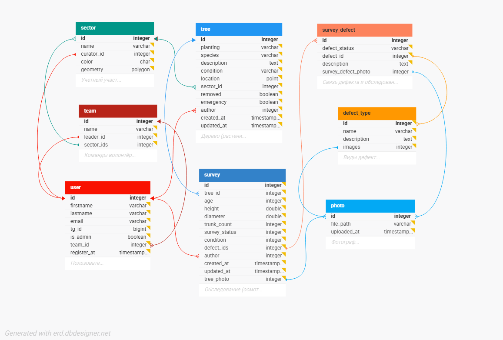

# Green Ranger API

Бэкенд для онлайн-сервиса «Зелёный рейнджер» — ГИС-системы для регистрации и мониторинга состояния деревьев.

## О проекте

«Зелёный рейнджер» — это платформа, объединяющая волонтеров и кураторов (сотрудников ботанических садов) для сбора, валидации и анализа данных о здоровье городских деревьев. Волонтеры "в полях" собирают данные с помощью мобильного приложения, а кураторы верифицируют их через веб-панель.

### Ключевые возможности

*   **Ролевая модель:** Четкое разделение прав доступа (Администратор, Куратор, Волонтер).
*   **Геоданные:** Использование PostGIS для хранения и обработки геолокаций деревьев и границ участков.
*   **Сбор данных:** Создание обследований, фиксация дефектов с привязкой фотографий.
*   **Валидация:** Механизм проверки и утверждения данных, присланных волонтерами.
*   **Атомарность операций:** Гарантия целостности данных благодаря паттерну Unit of Work.
*   **Безопасность:** Аутентификация на основе JWT с использованием access и refresh токенов.

## Технологический стек

- **Язык:** `Python 3.12`
- **Фреймворк:** `FastAPI`
- **База данных:** `PostgreSQL` + `PostGIS`
- **ORM:** `SQLAlchemy`
- **Миграции:** `Alembic`
- **Асинхронность:** `asyncio`, `asyncpg`
- **Окружение:** `Docker`, `Poetry`

## Архитектура

Проект построен на основе чистой многослойной архитектуры для обеспечения гибкости, масштабируемости и тестируемости:

1.  **Слой API (`/api`)**: Отвечает за прием HTTP-запросов, их валидацию (Pydantic) и вызов соответствующего сервиса. Роутеры, схемы, зависимости.
2.  **Слой Сервисов (`/services`)**: Содержит всю бизнес-логику. Оркестрирует взаимодействие между репозиториями и гарантирует атомарность операций с помощью паттерна **Unit of Work (`atomic_transaction`)**.
3.  **Слой Репозиториев (`/repositories`)**: Абстракция над источником данных. Отвечает за выполнение конкретных запросов к базе данных (CRUD), не содержа в себе бизнес-логики.
4.  **Слой Моделей (`/models`)**: Определяет структуру данных и связи (SQLAlchemy models).

Этот подход позволил централизовать управление транзакциями и ошибками, а также избавиться от циклических зависимостей.

## Документация API

Полная интерактивная документация API (Swagger UI) доступна по эндпоинту `/docs` после запуска приложения.

## Локальный запуск

1.  **Клонируйте репозиторий:**
    ```bash
    git clone git@github.com:tarrim80/green_ranger.git
    cd green_ranger/backend
    ```

2.  **Создайте и заполните `.env` файл** на основе `.env.example`.

3.  **Запустите проект с помощью Docker Compose:**
    ```bash
    docker-compose up --build
    ```

4.  **Примените миграции Alembic:**
    ```bash
    docker-compose exec backend alembic upgrade head
    ```

Приложение будет доступно по адресу `http://localhost:8000`.

## Схема базы данных


